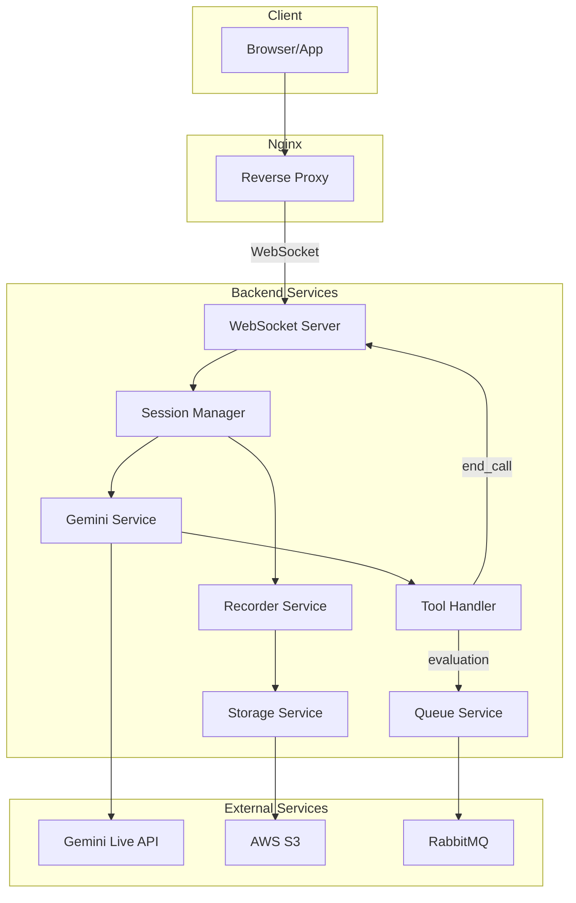
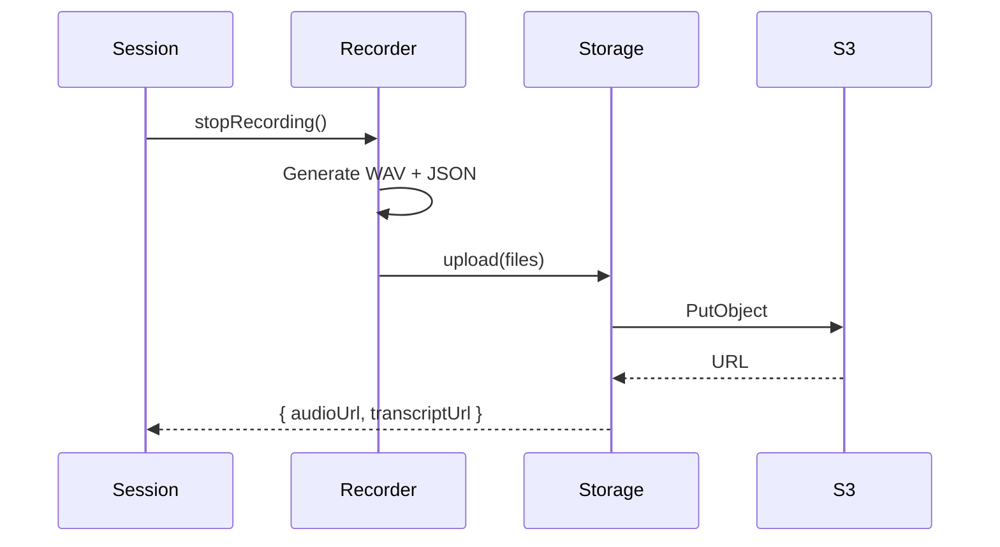
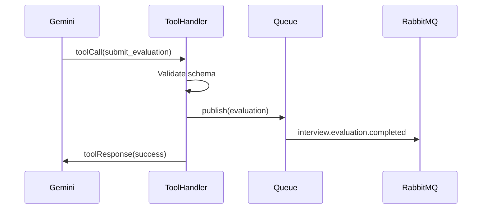

<!-- fa89291f-ac97-49f1-b3ae-51290b08c8f7 b026781a-cb36-4ee3-96cc-c409ccf812ba -->
# AI Interview Platform - Production Architecture

## Use Case

AI-powered interview platform where:

- Each session has a dynamic system prompt (interview context/questions)
- Gemini conducts the interview via voice
- AI can end the call using a function tool (triggers UI update)
- Final evaluation is generated via function tool and sent to RabbitMQ
- Recordings are uploaded to S3
- Works behind Nginx reverse proxy

## Architecture



## Project Structure

```
live-talk-gemini/
├── backend/
│   ├── src/
│   │   ├── index.js                 # Entry point
│   │   ├── server.js                # WebSocket server
│   │   ├── config/
│   │   │   ├── index.js             # Config loader
│   │   │   └── schema.js            # Config validation
│   │   ├── services/
│   │   │   ├── SessionManager.js    # Session lifecycle
│   │   │   ├── GeminiService.js     # Gemini Live wrapper
│   │   │   ├── RecorderService.js   # Audio/transcript recording
│   │   │   ├── StorageService.js    # S3 upload
│   │   │   └── QueueService.js      # RabbitMQ publisher
│   │   ├── tools/
│   │   │   ├── index.js             # Tool registry
│   │   │   ├── endCall.js           # End interview tool
│   │   │   └── submitEvaluation.js  # Evaluation tool
│   │   ├── handlers/
│   │   │   ├── MessageHandler.js    # Client message routing
│   │   │   └── ToolHandler.js       # Gemini tool call handler
│   │   ├── utils/
│   │   │   ├── logger.js            # Structured logging
│   │   │   ├── errors.js            # Custom errors
│   │   │   ├── audio.js             # WAV utilities
│   │   │   └── retry.js             # Retry with backoff
│   │   └── types/
│   │       └── interview.js         # Interview config types
│   ├── ecosystem.config.cjs         # PM2 config
│   ├── package.json
│   └── .env.example
├── frontend/
│   ├── src/
│   │   ├── components/
│   │   │   ├── InterviewPanel.jsx
│   │   │   ├── TranscriptView.jsx
│   │   │   ├── ControlBar.jsx
│   │   │   └── CallEndedModal.jsx   # Shows when AI ends call
│   │   ├── hooks/
│   │   │   ├── useInterview.js      # Interview state
│   │   │   ├── useWebSocket.js
│   │   │   ├── useAudioRecorder.js
│   │   │   └── useAudioPlayer.js
│   │   └── services/
│   │       └── api.js               # REST API client
│   └── package.json
├── nginx/
│   └── gemini-live.conf             # Nginx config
├── docker-compose.yml
└── README.md
```

## Key Features

### 1. Dynamic Interview Configuration

Client initiates session with interview config:

```javascript
// POST /api/interview/start
{
  "interviewId": "uuid",
  "systemPrompt": "You are interviewing for a Senior Engineer role...",
  "evaluationSchema": {
    "technicalSkills": "number 1-10",
    "communication": "number 1-10",
    "recommendation": "string"
  },
  "maxDuration": 1800  // 30 minutes
}
```

### 2. Gemini Function Tools

**end_call** - AI decides interview is complete:

```javascript
{
  name: "end_call",
  description: "End the interview call",
  parameters: {
    reason: "string", // completed, candidate_request, technical_issue
    summary: "string"
  }
}
```

**submit_evaluation** - AI provides final assessment:

```javascript
{
  name: "submit_evaluation", 
  description: "Submit final interview evaluation",
  parameters: {
    // Dynamic based on evaluationSchema from config
  }
}
```

### 3. S3 Upload Flow



### 4. RabbitMQ Event Flow



### 5. Nginx WebSocket Proxy

```nginx
# nginx/gemini-live.conf
upstream backend {
    server 127.0.0.1:8080;
}

server {
    listen 443 ssl;
    server_name interview.example.com;
    
    location /ws {
        proxy_pass http://backend;
        proxy_http_version 1.1;
        proxy_set_header Upgrade $http_upgrade;
        proxy_set_header Connection "upgrade";
        proxy_set_header Host $host;
        proxy_set_header X-Real-IP $remote_addr;
        proxy_read_timeout 3600s;
        proxy_send_timeout 3600s;
    }
    
    location / {
        root /var/www/frontend;
        try_files $uri /index.html;
    }
}
```

### 6. Resilience Patterns

- **Retry with exponential backoff** for S3/RabbitMQ
- **Circuit breaker** for external services
- **Graceful degradation** - continue if S3/RabbitMQ down
- **Health checks** for PM2 and load balancer
- **Session recovery** using Gemini resumption tokens

## New Dependencies

```json
{
  "@aws-sdk/client-s3": "^3.x",
  "amqplib": "^0.10.x",
  "pino": "^8.x",
  "pino-pretty": "^10.x",
  "zod": "^3.x"
}
```

## Implementation Order

1. Config module with Zod validation
2. Logger with Pino
3. Refactor GeminiService with tool support
4. Implement ToolHandler (end_call, submit_evaluation)
5. StorageService for S3
6. QueueService for RabbitMQ
7. SessionManager with full lifecycle
8. Update WebSocket server
9. Frontend call-ended handling
10. PM2 + Nginx configuration
11. Health check endpoints
12. Documentation

### To-dos

- [ ] Create config module with Zod validation for all settings
- [ ] Add Pino structured logger with request tracing
- [ ] Refactor GeminiService with function tool support
- [ ] Implement ToolHandler with end_call and submit_evaluation
- [ ] Create StorageService for S3 upload with retry
- [ ] Create QueueService for RabbitMQ publishing
- [ ] Refactor SessionManager with interview config support
- [ ] Update WebSocket server with new architecture
- [ ] Add CallEndedModal and handle AI-initiated call end
- [ ] Add PM2 config, Nginx config, health endpoints
- [ ] Remove old files, update docs